# Travel Order Microservice

Microsserviço desenvolvido em Laravel para gerenciamento de pedidos de viagem corporativa.

---

## Decisões Arquiteturais

O projeto foi estruturado com separação clara de responsabilidades, utilizando as seguintes camadas:

- **DTOs** — transportam dados entre as camadas sem expor detalhes internos
- **Domain Objects** — representam as entidades de negócio sem acoplamento ao ORM
- **Use Cases** — orquestram a lógica de negócio, cada um responsável por uma única operação
- **Repositories** — isolam o acesso ao banco de dados; o Model Eloquent é conhecido apenas por esta camada
- **Resources** — formatam a resposta da API antes de retornar ao cliente

O Model Eloquent (`TravelOrderModel`) é mantido exclusivamente dentro do Repository, impedindo que mudanças na estrutura do banco vazem para as demais camadas. O Domain Object (`TravelOrder`) é a representação pura da entidade, sem dependência de framework.

Use Cases foram preferidos ao padrão Service Layer por oferecerem isolamento por operação, facilitando testes unitários e tornando as responsabilidades mais explícitas. A Interface do Repository foi criada para permitir a troca da implementação sem impacto nas camadas superiores.

Notificações de aprovação e cancelamento foram implementadas via canal `database` do Laravel. Em produção, o canal pode ser estendido para `mail`, `Slack` ou qualquer outro driver sem alteração da lógica de negócio.

### 📊 Diagrama da Arquitetura

<p align="center">
  
</p>

## Decisões Técnicas

### Uso do Laravel Sail

Foi utilizado o Laravel Sail como ambiente de desenvolvimento para gerenciamento dos containers Docker.

A escolha foi feita com o objetivo de:

- Reduzir o tempo de configuração do ambiente
- Evitar a necessidade de configuração manual de Dockerfiles e docker-compose
- Garantir um ambiente padronizado e facilmente reproduzível
- Focar o desenvolvimento na regra de negócio ao invés da infraestrutura

---

## Requisitos

- Docker
- Docker Compose

---

## Instalação e Execução

### 1. Clone o repositório

```bash
git clone https://github.com/Esdras-Filipe/onfly-test.git
cd onfly-test
```

### 2. Copie o arquivo de ambiente

```bash
cp .env.example .env
```

### 3. Instale as dependências

```bash
docker run --rm \
    -u "$(id -u):$(id -g)" \
    -v "$(pwd):/var/www/html" \
    -w /var/www/html \
    laravelsail/php84-composer:latest \
    composer install
```

**Usuários Linux:** antes de rodar os comandos artisan, execute:
```bash
sudo chmod -R 777 storage/
sudo chmod 777 .env
sudo chmod -R 777 vendor/
```

### 4. Suba os containers

```bash
./vendor/bin/sail up -d
```

### 5. Gere a chave da aplicação

```bash
./vendor/bin/sail artisan key:generate
```

### 6. Gere a chave JWT

```bash
./vendor/bin/sail artisan jwt:secret
```

### 7. Execute as migrations e seeders

```bash
./vendor/bin/sail artisan migrate --seed
```

---

## Usuários Padrão

Após executar o seeder, os seguintes usuários estarão disponíveis:

| Role | E-mail | Senha |
|---|---|---|
| Administrador | admin@admin.com | 123456 |
| Usuário Comum | user@user.com | 123456 |

---

## Endpoints

Todos os endpoints (exceto login) requerem autenticação via Bearer Token.

```
Authorization: Bearer {token}
```

### Autenticação

#### Login
```
POST /api/login
```

Body:
```json
{
    "email": "admin@admin.com",
    "password": "123456"
}
```

Resposta:
```json
{
    "status": true,
    "token": "eyJ...",
    "type": "bearer"
}
```

---

### Ordens de Viagem

#### Criar ordem de viagem
```
POST /api/travel-order
```

Body:
```json
{
    "destination": "Lisboa",
    "departure_date": "2025-06-01",
    "return_date": "2025-06-10"
}
```

#### Consultar ordem de viagem
```
GET /api/travel-order/{id}
```

#### Listar ordens de viagem
```
GET /api/travel-order
```

Filtros opcionais via query string:

| Parâmetro | Tipo | Descrição |
|---|---|---|
| `status` | string | `requested`, `approved`, `cancelled` |
| `destination` | string | Filtra por destino |
| `departure_date_from` | date | Data de partida inicial |
| `departure_date_to` | date | Data de partida final |
| `return_date_from` | date | Data de retorno inicial |
| `return_date_to` | date | Data de retorno final |
| `sortBy` | string | Campo para ordenação |
| `sortDirection` | string | `asc` ou `desc` |
| `perPage` | int | Itens por página |
| `page` | int | Página atual |

Exemplo:
```
GET /api/travel-order?status=approved&destination=Lisboa&departure_date_from=2025-06-01
```

#### Atualizar status da ordem de viagem
```
PATCH /api/travel-order/{id}
```

Requer perfil de **administrador**.

Body:
```json./vendor/bin/sail artisan migrate --seed
{
    "status": "approved"
}
```

Valores aceitos: `approved`, `cancelled`

---

## Documentação (Postman)

Na raiz do projeto há um arquivo JSON contendo a collection do Postman com todos os endpoints da API.

Para utilizar:

1. Abra o Postman
2. Clique em **Import**
3. Selecione o arquivo `Onfly_Test.postman_collection.json` presente na raiz do projeto

A collection já contém:
- Todas as rotas configuradas
- Exemplos de requisição
- Estrutura de autenticação via Bearer Token

## Regras de Negócio

- O status inicial de toda ordem de viagem é `requested`
- Somente administradores podem alterar o status de uma ordem
- O usuário que criou a ordem não pode alterar seu próprio status
- Não é possível alterar o status de uma ordem já `approved` ou `cancelled`
- Ao aprovar ou cancelar uma ordem, o solicitante recebe uma notificação automática
- Usuários comuns visualizam e gerenciam apenas suas próprias ordens
- Administradores têm acesso a todas as ordens

---

## Testes

```bash
./vendor/bin/sail artisan test
```

---
